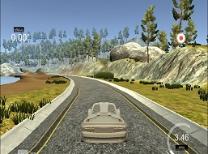
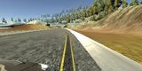
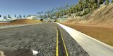
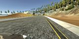
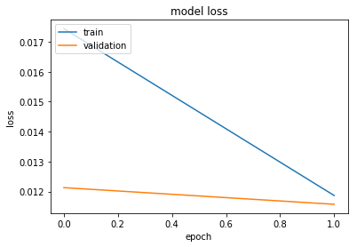

# Behavior Cloning - Project - 3

### Writeup File

Behavioral Cloning Project

The goals / steps of this project are the following:

* Use the simulator to collect data of good driving behavior
* Build, a convolution neural network in Keras that predicts steering angles from images
* Train and validate the model with a training and validation set
* Test that the model successfully drives around track one without leaving the road
* Summarize the results with a written report

#### Files Submitted & Code Quality
1. My project includes the following files:

 * model.py containing the script to create and train the model
 * drive.py for driving the car in autonomous mode
 * model.h5 containing a trained convolution neural network
 * writeup_report.md or writeup_report.pdf summarizing the results
 
2. Submission includes functional code

 * Using the Udacity provided simulator and my drive.py file, the car can be driven autonomously around the track by executing - 
 python drive.py model.h5
 
3. Submission code is usable and readable
 * The model.py file contains the code for training and saving the convolution neural network. The file shows the pipeline I used for training and validating the model, and it contains comments to explain how the code works.

#### Model Architecture and Training Strategy

1. An appropriate model architecture has been employed. Description of each layer of the model.
 * Lamdba layer. This layer will normalized the image to have near 0 mean. This optimizes the gradient descent process.
 * 2D Convolution layer with a filter size of 5x5 and stride of 2x2. Output of this layer has a depth of 32.This layer is followed by Relu Activation layer to introduce non linearity in the model and MaxPooling to reduce overfitting.
 * Another 2D Convolution layer with a filter size of 5x5 and stride of 2x2. Output of this layer has a depth of 64. This layer is also followed by Relu Activation layer to introduce non linearity in the model and MaxPooling to reduce overfitting.
 * Flatten layer, this will flatten the output from Convoltion layer and it wil be passed to Dense layer.
 * The model has 3 Dense layer with output 128,64 and 1 respectively.
 
2. Attempts to reduce overfitting in the model
 * The model contains dropout layer in order to reduce overfitting. The model was tested by running it through the simulator and ensuring that the vehicle could stay on the track

3. Model parameter tuning
 * The model used an adam optimizer, so the learning rate was not tuned manually
 
4. Appropriate training data
 * Training data was chosen to keep the vehicle driving on the road. I used a combination of center lane driving, flipped images so angles are not steering angels are not biased. Images of all the 3 cameras - center,left and right has been used.

#### Model Architecture and Training Strategy

1. Solution Design Approach and final approch.

 The strategy for deriving a model architecture is based on LeNet-5. My first step is to use a 2D Convolution layer with a small filter, this will detect rudimentary feaurtes on the road (as most of the sky and tress are cropped). Then I have a second 2D Convolution layer to detect more higher level features like turns and straight road. As images are are simple and there are not objects like pedestrians and traffic signs, I do not find any requirement of more ConNets to detect complex features. In order to minimize the output, MaxPooling layers are added after each CovNet and Relu layers are added to introduced non linearity. There are 3 Dense layer in my model to gradually give the final result, which is a single number indicating the steering angle the car should take. 
 
 The final step was to run the simulator to see how well the car was driving around track one. Initially, the vehicle was not running in a straight line and was left biased. To imporve this, I added flipped images and added images of left and right cameras as well, I corrected the steering angle for left and right images as the value of steering is with respect to center camera. At the end of the process, the vehicle is able to drive autonomously around the track without leaving the road.
 
 The final model architecture (model.py lines 106-132) consisted of a convolution neural network with the following layers and layer sizes 
 
 1. Convolution2D. Output depth - 32
 2. Activation - Relu
 3. MaxPooling - 2x2
 4. Convolution2D. Output depth - 64
 5. Activation - Relu
 6. MaxPooling - 2x2
 7. Flatten
 8. Dense. Output -128
 9. Dropout
 10. Dense - Output - 64
 11. Dense - Output - 1
 
2. Creation of the Training Set & Training Process
    To capture good driving behavior, I first recorded two laps on track one using center lane driving. Here is an example image of center lane driving
 
 
 
 I then recorded the vehicle recovering from the left side and right sides of the road back to center so that the vehicle would learn to come to center when it goes in corner. These images show what a recovery looks like starting from right and coming to center.

   
 
 To augment the data sat, I also flipped images and angles thinking that this would ... For example, here is an image that has then been flipped:

I used model.fit_generator to train and validatate my model. The graph of training loss and validation loss vs number of Epochs (which is 2 in my case) is like this 

#### Conclusion 

I can clearly say that, the prime part of any neural network is how well we train it and keeping it mind it does not overfit, for this we need more data, variety of data and correct data. To improvise this model, to run on more complicated tracks, we will need more data where we have car, pedastrians etc and to understand these complex things, our network will need more layers, where higher layer will be detecing higher feaures like another car or a traffic sign. 

Just like my neural network, I will also have to continue my training with more input data to make this happen.
